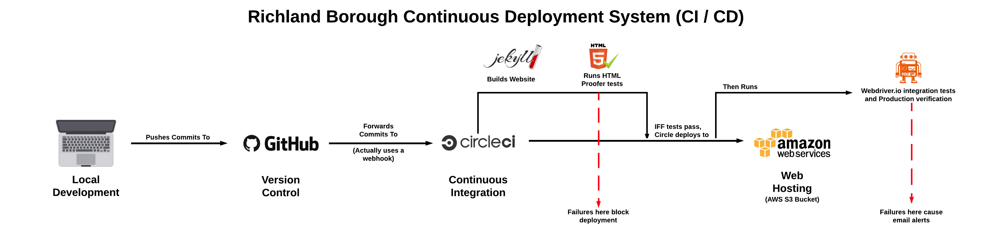

# Richland Jekyll

---

Yeah, I guess I should document this. Might as well do that now. Some day I'll probably have to hand this off to someone, so it would probably be a good idea to write stuff down now while I remember how this works.

## The Old Way

Richland's website was originally built under the assumtion that maitenence would 
be handed off the the borough secretary. As such, the original was made 
using a WYSIWYG that was reccomended by someone who maintains a neighboring
borough's website. When it was decided that I would be maintaining the 
website, I quickly abandoned the program, and began maintaining a static
HTML/CSS/some JavaScript-version at [this repository](https://github.com/wadeanthony0100/Richland-Borough-dot-org).
This worked well the time but it had some issues. Notably:

- **Human error**. Without a build system or build-time error checking, I was
frequently having broken or missing links brought to my attention.
- **Poor separation of concerns**. With everything being written statically,
there was often duplication of data, and every time I made a change, I would
have to change multiple files. This became increasingly difficult when I would
spend weeks at a time not looking at the code base, often missing critical parts
of time sensitive updates
- **Limitations in  moving forward**. Things are just easier when you can generate them
at compile time.

This version was put together to try to mittigte some of these issues, and accomplishes that well.

## How does this even work?

Put simply: ruby, markdown, and magic.

Jekyll is a neat tool that lets you define your views with markdown, and then compile them
to the HTML/CSS/JS that we serve to our users.

I also wrote [a custom plugin](https://github.com/wadeanthony0100/Richland-Jekyll/blob/master/_plugins/minutes.rb)
to look through the `/meeting_minutes` directory, and generate a table of links to the meeting minutes files
for the [Meeting Minutes page](richlangborough.org/meeting_minutes). Yeah, it's a messy script,
but it does the job, and it only runs at compile time, so the complexity is as good as arbitrary.

To improve the issues with broken links, there is a rigorous suite of tests that a build must pass in order to
be pushed into production. In picture form, it looks like this:

## Development

### Setup

You must have `Git` and `Ruby` installed on your system, and paths properly configured. Use Homebrew on Mac, or your package manager of choice on Linux. If you're on Windows, I dunno good luck.

- `git clone <repo url>`
- `gem install bundler`
- `bundle install`
- Develop things...

### Build

- `jekyll b`
- Alternitavely, you can run `jekyll b --watch` to have jekyll rebuild everytime you write changes to a project file.

### Deploy

- Push commits to origin/master `git push origin master`
- Done. (sort of)
- You can watch your build run on [CircleCI here](https://circleci.com/gh/wadeanthony0100/Richland-Jekyll). If the build passes, you should be deployed. (But do check the live site to confirm your changes were applied)
- If the build is rejected, it should tell you what was broken, and you should fix that and push again.

## Common Tasks

The most common updates to the site are (1) adding monthly meeting minutes and (2) adding removing pages. These tasks in particular were made as simple as possible in the transition to this system, so they are reletively painless to do:

### 1. Adding Monthly Meeting Minutes

I usually recieve this item as a word document over email. Use your conversion tool of choice to produce a PDF file- MS Word does fine, as does Google Drive's conversion utility. Just place this file in the `/meeting_minutes` directory of your local version of the site, `git add meeting_minutes`, `git commit -m "Update meeting minutes"`, and `git push origin master`. Done. You could probably make a bash script for that. I'm not doing that.

### 2. Adding / Removing Pages (Tabs)

All the pages are defined in Markdown in the root of the project. If you want to add a page, I would make a copy of `refuse.md` and work from there. Note that the navigation order is based on the `weight` attribute in the file's header. Unless you want to pull a page to the beginning of the navigation order, leave it at 10 so it defaults to alphabetical order with the other pages in that section.

Markdown is pretty simple, this README is written in is, as well as most of the pages (except the ones I didn't feel like rewriting). If you need to lookup a reference, I like [this one](https://github.com/adam-p/markdown-here/wiki/Markdown-Cheatsheet).

Removing pages is even easier, just delete the file and `git add` it, `commit`, and `push`. Don't worry, you can always step back in the version control history if you ever want to bring it back online.

## Other Notes

- I have SSH Access to the server. If you take over this project, ask me for it and I can give you access. You should really only need this if you choose to overhaul this system. That is something you can do, but make sure you have a good reason for it. You should also note that our current server setup disallows running a whole lot of stuff. Compiling the project to static files and pushing that to the server works well for this reason.

---

This is a recreation of [the original static version of Richland Borough's website](https://github.com/wadeanthony0100/Richland-Borough-dot-org).
