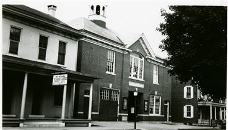
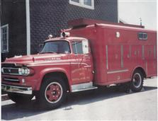
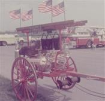

<!--Facebook SDK-->

<!--Slideshow files-->

<link href="files/slideshow/jquery.bxslider.css" rel="stylesheet" />

# Neptune Fire Company

The Neptune Fire Company, formed in 1907, was originally located on North Park Street and used a hand drawn Wirt Knox Chemical Engine.

The current fire station, on Main Street, was built in 1922 with the addition of a 1921 Seagraves motorized triple combination pumper.

In 1947 the fire company took delivery of a 1947 Mack type 75 engine, which stayed in service until 1998.

In 1959 they took delivery of a Dodge-Brightbill Squad truck.

In the mid seventies the fire company refurbished and added on to their building and bought a 1974 Mack CF600 engine.

The 1959 Squad was replaced in 1993 with a Volvo/Saulsbury Squad. This truck continues to be one of the largest air trucks in the region.

1998 saw the addition of a new modern pumper. It is a large pumper with a 1750 gpm pump and 1250 gal of water and is affectionally known as the "Beast".

In 2002 the fire company started the QRS Unit and ran it off the Fire Police Unit until they purchased the Ford 550 Utility, in 2005, when they sold the 1974 Mack.

In 2007 they celebrated the 100th year of the company by hosting the Lebanon County Firefighter's Convention. The First County Convention was held, in Richland, in 1922, and the current plan is to have the 100th Anniversary of the County here as well.

For more information about the Neptune Fire Company, including events, happenings and banquet hall information, visit their website at [neptunefire.com](http://www.neptunefire.com), or check them out on [Facebook](https://www.facebook.com/Neptune-Fire-Company-128101647275868/).

<!--slideshow-->

	<ul class="bxslider">
		<li></li>
		<li></li>
		<li></li>
		<li></li>
		<li></li>
		<li></li>
		<li></li>
		<li></li>
	</ul>

<!--end slideshow-->
