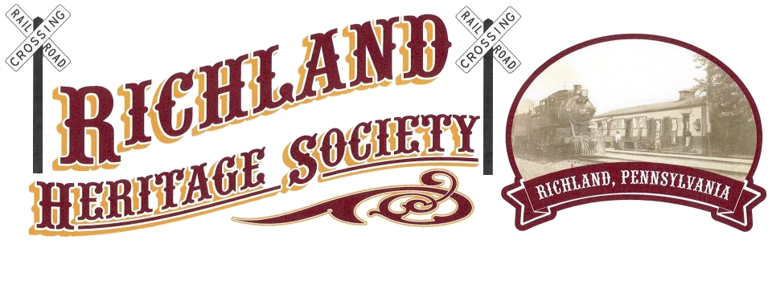

# Richland Heritage Society

The Richland Heritage Society, formed in June of 2012 by President Gary Althouse, Sr., is organized exclusively for charitable purposes under Section 501 © of the Internal Revenue Code.

The corporation was established to "Preserve, promote and interpret the history of Richland, Pennsylvania" and will do this through collecting and preserving historical documents and obtaining information to assist in genealogy research.

The Richland Heritage Society presents and organizes community events to celebrate our local history. These activities always take place in Richland, Pennsylvania by members and volunteers of the Richland Heritage Society.

---

To contact the Richland Heritage Society:

|Mail:     | Richland Heritage Society, PO Box 128, 26 n Race St., Richland, PA 17087 |
|          |                                                                          |
|Phone:    | 717-866-7050                                                             |
|          |                                                                          |
|Website:  | [richlandheritagesociety.org ](http://www.richlandheritagesociety.org)   |

Like them on Facebook!

