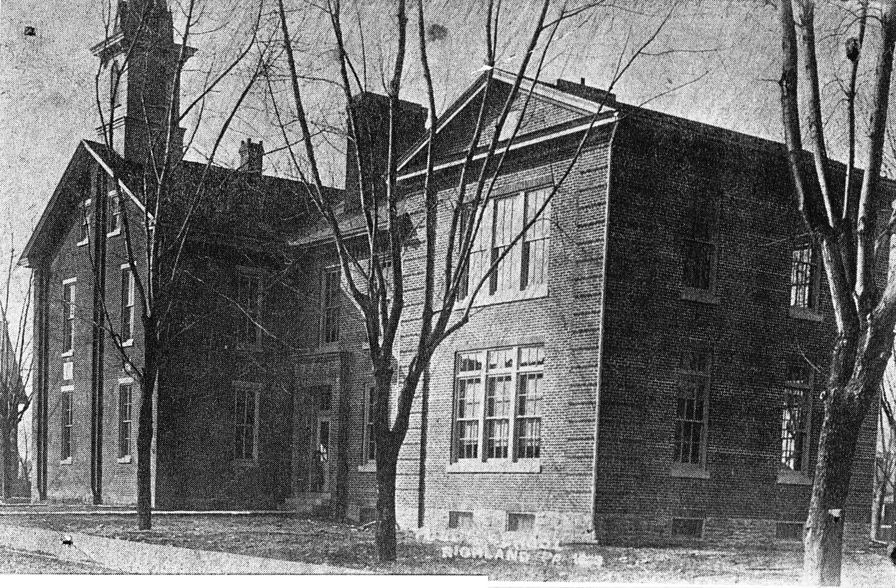
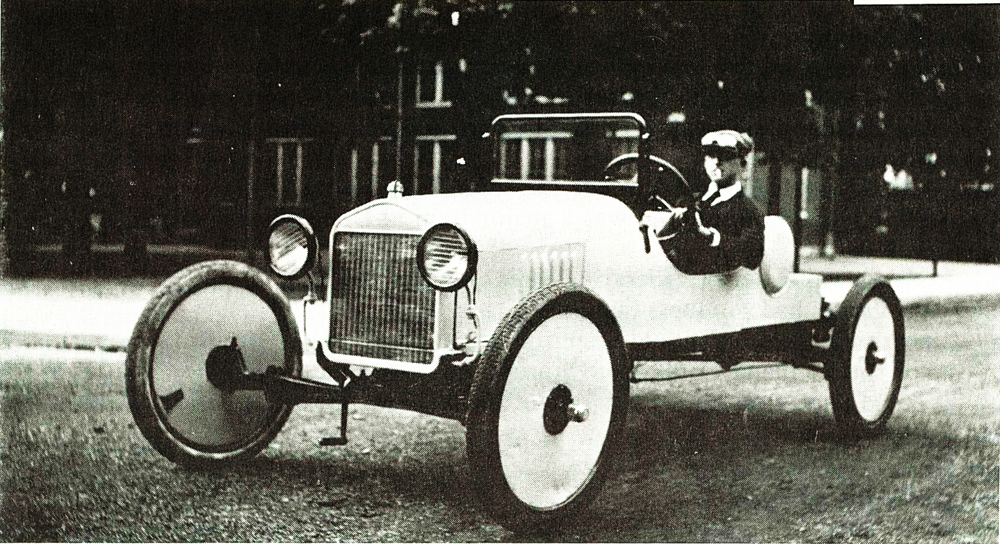

# A Brief History of Richland

Among the early settlers in the vicinity were a few Landis families and originally the town was named after them - Landisville. However, there was another Landisville in the adjoining County of Lancaster and this resulted in a confusing situation between the two towns bearing the same name. The name of Richland was selected because of its surroundings and the town soon established for itself an independent reputation.

The Lebanon Valley Branch of the Philadelphia and Reading Railway was built between 1854 and 1857, and during this time there were three houses in Richland. The first station was a Baggar Car. Two years after the Railroad was completed a permanent Depot was launched, when a grain warehouse was erected by Mr. Stump and Mr. Klopp. The warehouse was destroyed by fire in 1920 at which time it was owned and occupied by C S Kalbach.

In 1858 a Brick Yard, Saw Mill and a Wood Working Mill were established. By 1920 they were no longer in operation.

The first merchant was Edward Landis, who started his enterprise in 1863. He was followed four years later by Mr. Godshalk and Isaac King, of King Bros., and was later succeeded by A.K. Krall.

About the same year Edward Noll started a blacksmith shop and coachworks.

William Noll opened a furniture store and undertaking parlor in 1867.

In 1868 the Band Hall was erected and Allen Bollinger built a distillery. Two hotels came a few years later.

In 1871 the first cigar factory was built and operated by Samuel Klopp. The Hertzler and Kline Cigar factory soon followed.

A tinsmith shop was established by Mr. Stewart in 1872.

The old school house on North Park Street was replaced by a four room school in 1878 under the supervision of Dr. Joseph Zimmerman, who was then one of the Directors. In 1912 a two room High School addition was built by Thomas B Weik, Contractor. Hauer and Mowrey were the Architects.

In 1881, ten years after founding his cigar factory, Samuel Klopp pooled his interest with Isaac Kegerries and started the Klopp and Kegerries Cigar Factory. They also did a business in leaf tobacco. In this plant cigar makers were paid 15 cents per hundred; tobacco strippers received from fifteen to twenty five cents per day, and the forelady was paid two dollars per week.

In 1882 A.F. Diehl built a stove, furnace and tinware store.

G.L. Dry's General Merchandise Store was started in 1887.

The Moore and Frank Cigar Factory was established in 1890. Four years later the R R Frank and Company Cigar Factory was built and operated. This was succeeded by F.L. Stoltz Cigar Factory.

At one time Richland had more than thirteen industrial establishments, giving employment to its residents and to the inhabitants of nearby towns. Listed below is a short recap of the many early businesses in Richland:

## Holstein Pump: 
M. B. Holstein, the inventor of the Auto Pump, pooled his interest with A.C. Haak and others and incorporated into the Holstein Mfg. Co., with a capital of $75,000. Their product was marketed over the entire United States. The unique feature of the Holstein pump, was the fact that it inflated on both the up and down stroke. All other pumps blew air on the down stroke only. The business continued on North Race Street until 1921 when he sold it to Paul J. Bickel, who operated it on New Street.

## Canning Factory: 
In 1903 a Canning Factory was erected and was operated for only a few years. The plant was sold and entirely removed.

## Cigar Box Factory: 
George Tice operated a Cigar Box Factory on Strawberry Alley. In 1903 he sold out his interest to M.H. Wiest, who erected his factory to the rear of his residence, and was later operated by M.H. Wiest and Son.

## Bakeries: 
Henry Firestone started the first bakery in 1895. The bakery was later operated by Steiner and Layser, on South Race Street. John Yocum started a bakery a few years later. He was succeeded by Sellers and Landis. After operating for a short time they, again, sold out. The bakery was then operated by N. B. Bollinger.

## Printing: 
M.R. Landis started the first printing office by the use of a small hand press. His business grew rapidly and new presses were added. He sold out his interest to Snook and Levengood. Shortly before the death of Mr. Snook, Snook and Levengood bought out a small paper known as "The Narrow Way". After the death of Mr. Snook, the presses were sold to different parties and Mr. Levengood began to devote his entire time to "The Narrow Way" and started a stationery store in connection, handling bibles, mottoes and other religious books. Jeremiah Hartman was one of the Editors of "The Narrow Way".

## Shoe Factory: 
Curtis & James Co. started a fitting room for the manufacturing of shoes on the thisr floor of the Richland House in 1916. Later, during the same year, ground was broken for the erection of a three-story shoe factory. this was occupied furing the spring of the following year. an addition was added and occupied during 1920.

## Blacksmith Shops and Coach Works: 
After the death of Mr. Edward Noll, his son in law, Philip Spatz, continued in the repairing and painting of vehicles in the shop formerly occupied by Mr. Noll. George Dissinger was in charge of the Blacksmith work. During later years Harry Hoffa started the same type of business on the corner of Peach and Blackberry Alleys.

## Tobacco Factory: 
In 1912, Paul Wike, who came to town from the Schaefferstown area working as a cigar maker for M.J. Klopp, started his new enterprise - the manufacture of Belt Line Buds and Scrap, in a small shop on South Park Street. He later moved it to North Race Street.

## Furniture and Undertaking: 
William H Noll was the first furniture dealer and undertaker, operating his business on East Main Street. He was succeeded by Jacob C. Steiner from Akron, PA.

## Grain, Feed and Coal: 
After a fire at C.S. Kalbach's warehouse on Main Street, Mr Kalbach remodeled the old storage warehouse by putting in grain elevators. He operated a coal chute in conjunction with the grain and feed business. M.T. Loose engaged in the retail coal business, followed by his son who later sold the business to Robert Weigley.

## Saddler: 
Adam Saltzer was the first saddler in town and continued in the business until working part time in his late years. Henry Frantz, of Berks Co., started the same business after Henry Frantz.

## Painting and Paper Hanging: 
There were two places of business in town in early years. David E. Layser started house painting and paper hanging from his business on S. Race Street. W.W. Weigley was also in the paper hanging trade from his business on E. Main Street.

## Tanners: 
During 1921 U.B. Yingst and Henry Frantz started a tanning factory under the name of Frantz and Yingst.

## Physicians: 
Dr. Joseph Zimmerman, MD, was the first physician in Richland. He later moved to Lebanon and sold his Richland practice to Dr. Levi Zimmerman who later partnered with his son, Curtis. After practicing for a few years they, too, moved to Lebanon and were succeeded by Dr. John D. Boger, MD, in 1920.

## Pants Factory: 
In 1922 I.K. King and Peter Phillippy built and operated the Eureka Pants Factory on S. Park Street.

## Butchers: 
Forry and Sons operated a slaughter house and meat market on Peach Alley. In 1948 the Forry Butcher Shop was purchased by the Borough for the storage of its equipment. In June of 1966 the Borough Council met for the first time in the newly constructed building at the corner of Peach Alley and Pine Street - the former location of Forry Butcher Shop.

## Garages: 
Harry Kessler built the first garage on Church Street and sold the Oakland Car as well. In 1918 the Leffler Garage was erected and was later operated by S.M. Rittew, a dealer in Doge and Buick automobiles.

In 1919 Harry Stohler built a garage on S Race Street and operated under the name of Richland Motor Co. and dealt in Ford and Overland Cars.

## Chocolate Factory: 
In 1921 the King Chocolate Company was organized with a Capital of $35,000. They erected a beautiful factory on S. Race Street.

## Cement Workers: 
Hertzler and Wenrich were the first cement workers in town laying quite a few of the sidewalks, which the borough was very proud of.

## Restaurants: 
The first restaurant in town was owned by W.W. Weigley on Main Street. The second restaurant was started by J.D. Sechrist, who was succeeded by C.E. Reich. In 1922 William F. Wagner built a new restaurant on N. Park Street.

## Hotels: 
There were originally two hotels in town. George H Eckert owned what was formerly the Richland House. It was later called Eckert's Hotel.

## Tin Smith: 
Miles W. Diehl succeeded A.F. Diehl, who had originally erected the stove, furnace and tinware store. M.W. Diehl began a business, of the same nature, on E. Main Street.

Thomas B. Weik was the first contractor and builder in Richland and erected quite a few homes and larger buildings in town before his death. He was succeeded, in 1921, by R.R. Robinson, who conducted his business on S. Race Street.

## Fruit Cakes: 
U S G Steinmetz had a very successful business of baking fruit cakes at his place of business on S. Race Street.

## Shirt Factory: 
In 1920 Liebovitz and Son started a branch factory in the borough. In 1921 they built a new factory on N. Park Street.

## Barbers: 
Jacob Buffamoyer conducted the first barber shop in town. He was assisted in later years by his son, Roy, and continued in business until Roy's death.

Some years later, Oscar A. Sellers, a native of Palmyra, started a barber shop business on Main Street. He was assisted by Harold Wolfskill.

## Insurance: 
In 1911 M.D.M. Batdorf started the Richland Agency representing a number of leading insurance companies of that time.

Miss Sallie Kegerries succeeded her father in representing the Northern Mutual Company of Ephrata, PA.

## Plumbing: 
John L. Crouse started a plumbing and heating business in the borough, but after a few years he left town.

Samuel B. Hassler later opened a show room of plumbing and fixtures on East Main Street where he conducted a general plumbing and heating business.

## Notary Public & Justice of the Peace: 
After Isaac Kegerries' death, his daughter Sallie Kegerries was commissioned the Notary Public with an office on East Main Street.

Harry A. Blecker was the Justice of Peace and had an office on West Main Street.

## Watch and Jewelry Repair: 
L.D. Landis had the first watch repair business on East Main Street in Richland.

George H. Mountz later made and repaired watches, as well as conducted a jewelry trade in the old Diehl home on East Main Street.

## Horse and Cattle Dealers: 
H.B. Pennypacker, a native of Pottstown, was the well- known horse and mule dealer with headquarters at the Richland House.

I.F. Weigley was also engaged in the horse business, at one time. Later he devoted his entire time in the buying and shipping of cattle, with headquarters in the Richland House.

## Hogs: 
J.P. Robinson raised pure bred registered Berkshire Hogs for a number of years and sold his stock over the entire state of Pennsylvania.

## Incorporation of the Borough: 
August 9, 1906 the citizens of Richland held a public meeting on the subject "The Advantages of a Borough". August 11 Isaac Kegerries, assisted by J. S. Steinmetz, D.K. Weigley and H. Leitener made a survey of the proposed new borough.

August 12 the plan was put in circulation and by 11 PM it had fifty signatures.

August 16th M.E. Holstein took the petition to the County Court House and presented it before the court.

September 17 the Honorable A.W. Ehrgood, presiding Judge, granted the Charter.

Feb 25, 1907 the first Borough Council met and organized.

# History of Services to Richland 

## Fire Company: 
In 1907, one year after Richland became a Borough, the Neptune Fire Company No. 1 was organized with 51 charter members. Prior to that time firefighting was accomplished by means of a bucket brigade, or if you were attached to the town's water system, a garden hose. Serious fires resulted in total loss.

The name Neptune was chosen because of him being the "Roman God of the Sea".

The first president of the fire company was U S G Steinmetz and the first fire chief was J S Steinmetz.

In May of 1907 the fire company purchased its first apparatus, a Marten-Diggs 2 wheel hand drawn chemical engine, for $850.

For more information on the Neptune Fire Company, please select the "Fire Company" tab on this website or go to their website www.neptunefire.com.

## Water Company: 
The Richland Water Company was incorporated in 1888 when a three inch main was laid from the South Mountain to the borough.

In 1904 the Stand Pipe was erected.

Ten years later the borough took over the Water Plant and eight and six inch mains, connecting all the principal streets, were laid and also fire hydrants were installed.

In 1921 a Lutweiler Deep Well Water Pump was installed to supply water in emergency from a well drilled by Kohl Brothers in Myerstown.

## Gas and Electricity: 
The Myerstown Gas and Fuel Company laid their gas mains around 1908. About the same time the Newmanstown Electric Light and Power Company built their electric line in the borough limits.

## Realty and Improvement Company: 
The Richland Realty and Improvement Company was incorporated in November 1919 with a Capital of $25,000.00. Two double homes were erected on South Park Street and sold shortly after completion. Two lots were bought from Sallie Kegerries on Poplar Street for the building of two dwellings in the fall of 1920.

## Lodges: 
Washington Camp No 160 P.O.S. of A was organized in 1886 and had a membership of 153 in 1920.

Richland Lodge No. 28 Knights of Phythias was organized in 1907 with 17 charter members. As of 1920 it had 120 members.

Camp 8467 of the Modern Woodmen of America was organized in 1918.

## The Richland National Bank: 
In the Spring of 1906, F.J. Lehman felt it was necessary to have a bank in Richland. The project was started after he called together a number of leading citizens.

On June 20, 1906, the articles of Association were formed. The authorized Capital was $25,000.00. The charter was signed August 19, 1906 by F.P. Kane, Deputy Comptroller.

The bank was opened for business Sept 18, 1906 in the Elmira Shirk Building on Main Street.

In 1908 the new Bank Building was completed and remains in existence today, although it is no longer used as a bank.

# History of Churches in Richland
In 1901 the Grace Reformed Church was erected on the corner of Church and Park Streets. Today it is called Grace UCC Church.

Grace Evangelical Church was also erected that year on Main Street. Today it is the home of the Faith Community Church.

In 1912 the Lutheran Church was formed. They remodeled the Chapel, which was used by different denominations. Today it is the home of the Richland Library.

The Richland Church of the Brethren was built on South Race Street in 1912. It remains in existence today.

---

Information taken from "Our Town USA, Richland, Pennsylvania" published in 1976 by the Richland Bi-Centennial Committee Editors: Shirley Weinhold and Ned Shanaman
