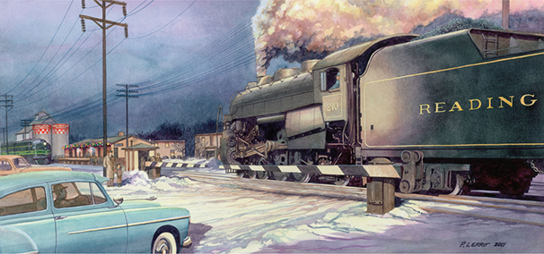
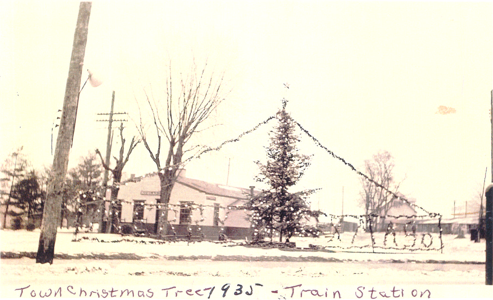
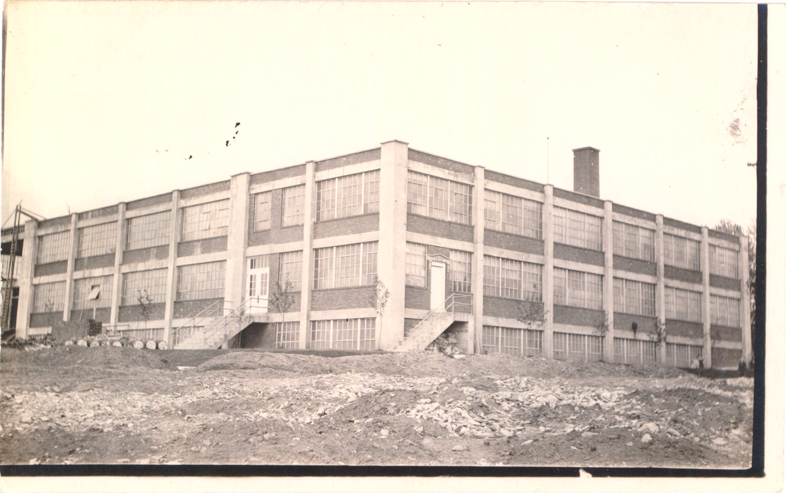
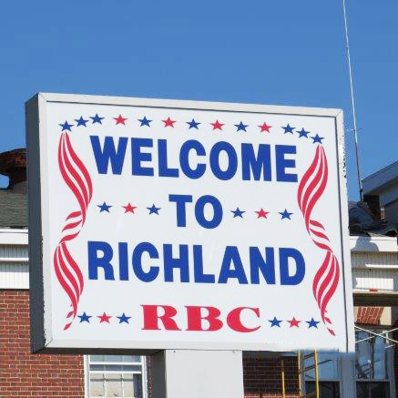
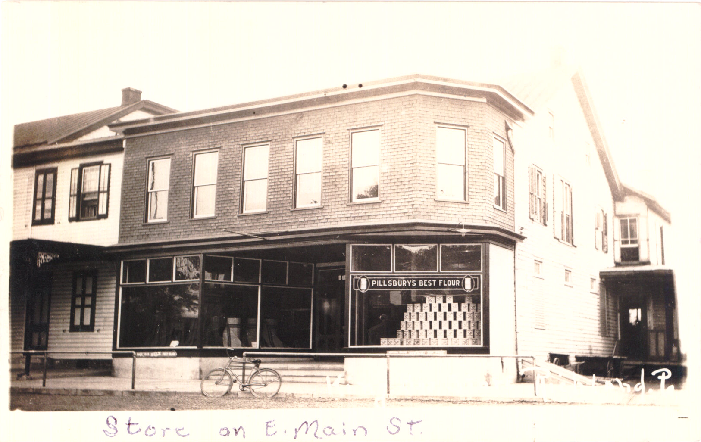
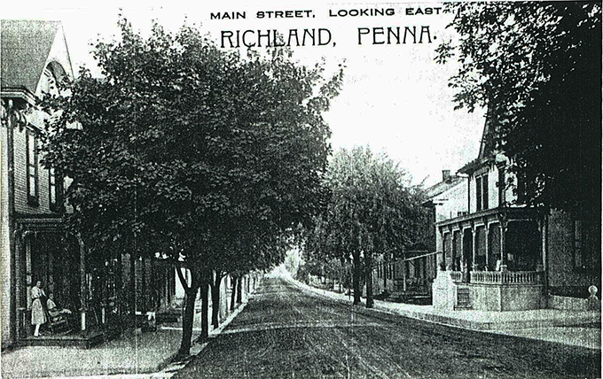
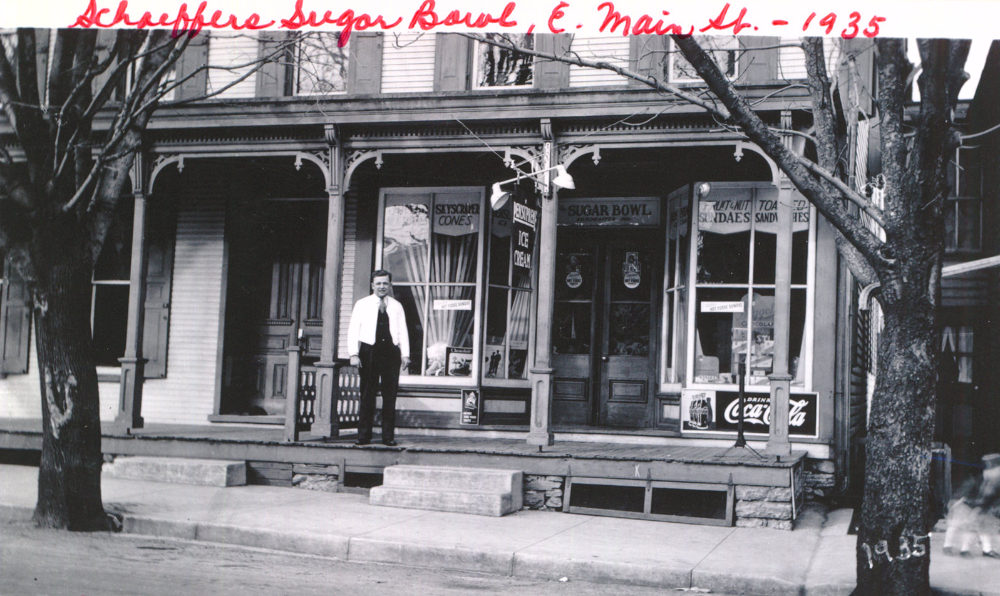
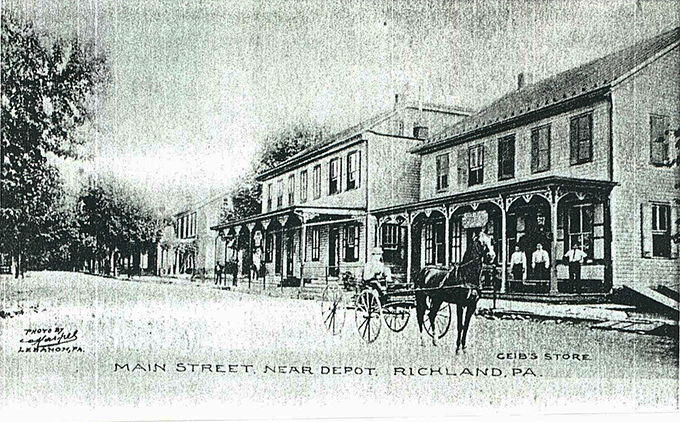
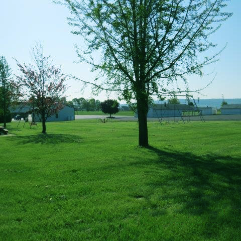

<!--Slideshow files-->

<link href="files/slideshow/jquery.bxslider.css" rel="stylesheet" />

###### Used with permission of Philip Klopp and Peter A. Lerro, Jr., Artist

  <i class="fa fa-exclamation-circle alert-primary" aria-hidden="true"></i>
  The Christmas Tree Lighting Service will be at the town tree on Nov 17 @ 5:30pm.
  Santa will arrive by Fire Engine!
  In the event of inclement weather we will hold the service in the Engine Room of the Neptune Fire Hall. 

Welcome to the Richland Borough Website.
Richland Borough, nestled in the Eastern part of Lebanon County, Pennsylvania,
is a picturesque town named  for its fertile soil.

Incorporated from Millcreek Township in 1906, the town
is unique in that it has an active railroad crossing
which intersects the town square. Main Street and Race Street, which also
intersect at the square, link the northern and southern portions, as well as
the eastern and western portions, of the borough. Thus, the crossing divides
the entire town causing Richland to be mentioned in "Ripley's Believe It or Not"
books and on the televised game show "Jeopardy".

<!--slideshow-->

	<ul class="bxslider">
		<li></li>
		<li></li>
		<li></li>
		<li></li>
		<li></li>
		<li></li>
		<li></li>
		<li></li>
		<li></li>
		<li></li>
		<li></li>
		<li></li>
	</ul>

<!--end slideshow-->
