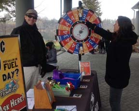

# Polar Bear Plunge

### Willow Springs Park 199 Millardsville Road, Richland, PA

Willow Spring's Park, owned by Tom and Joya Morrissey, has been hosting the Annual Polar Bear Plunge for the past 24 years, on New Year's Day. 

Located on the outskirts of Richland, the Polar Bear Plunge raises money for DDS (Developmental and Disability Services) and provides services to children and adults with disabilities living in Lebanon County. 

The park welcomes Polar Bears, scuba divers and spectators beginning at 9 AM for tailgating and a pre-plunge party with a DJ, food vendors and games. Polar Bears who collect pledges through a "Cold for a Cause" campaign can turn them in for a free parking pass. Parking is $20 on the quarry grounds, due to space limitations. Free parking is available at Dutchway Farmers Market, where a shuttle bus runs from 10:30 AM-1 PM. 

This year the Polar Bear Plunge raised over $20,000 for the DDS. For more information visit [ddslebanon.org](http://www.ddslebanon.org/). 

